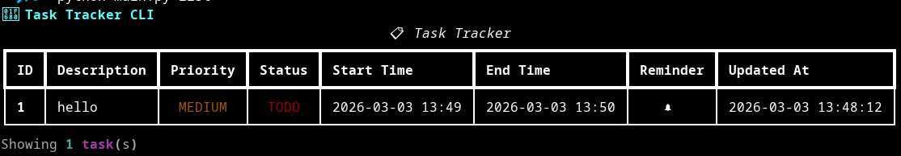
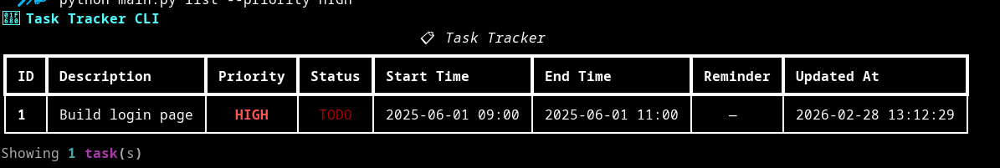

# 📋 Task Tracker CLI

A fast, lightweight command-line task manager built with Python. Manage your tasks, set priorities, track progress, and get desktop reminders — all without leaving your terminal.


---

## 📸 Screenshots

### Task List View


### Adding a Task


### Filtering by Priority


---

## ✨ Features

- ✅ Add tasks with start/end times and priority levels
- 🔄 Track status: `TODO` → `IN_PROGRESS` → `DONE`
- 🔴🟡🟢 Color-coded priorities: `HIGH`, `MEDIUM`, `LOW`
- 🔔 Desktop reminder notifications before deadlines
- 🔍 Filter tasks by status or priority
- ✏️ Update any task field without deleting and re-adding
- 💾 Persistent storage via local JSON file
- 🧪 Full test suite with `pytest`

---

## 🛠️ Tech Stack

- **Python 3.10+**
- **[Rich](https://github.com/Textualize/rich)** — Beautiful terminal UI
- **[Plyer](https://github.com/kivy/plyer)** — Cross-platform desktop notifications
- **[Pytest](https://pytest.org)** — Automated testing

---

## ⚙️ Installation

**1. Clone the repository**
```bash
git clone https://github.com/your-username/TaskTracker.git
cd TaskTracker
```

**2. Create and activate a virtual environment**
```bash
# Create
python -m venv venv

# Activate — Mac/Linux
source venv/bin/activate

# Activate — Windows
venv\Scripts\activate
```

**3. Install dependencies**
```bash
pip install -r requirements.txt
```

---

## 🚀 Usage

### Add a Task
```bash
python main.py add "Build login page" --start "2025-06-01 09:00" --end "2025-06-01 11:00" --priority HIGH --remind
```

### List All Tasks
```bash
python main.py list
```

### Filter by Status or Priority
```bash
python main.py list --status TODO
python main.py list --priority HIGH
```

### Update Task Status
```bash
python main.py status 1 IN_PROGRESS
python main.py status 1 DONE
```

### Mark a Task Complete (Shortcut)
```bash
python main.py complete 1
```

### Edit a Task
```bash
python main.py update 1 --description "New description" --priority LOW
python main.py update 1 --end "2025-06-01 15:00"
```

### Delete a Task
```bash
python main.py delete 1
```

### Start Notification Service
```bash
python main.py notify
```
> Runs in the background and sends a desktop alert 1 minute before any task deadline.

---

## 📁 Project Structure

```
TaskTracker/
├── main.py            # Core application logic + CLI
├── test_main.py       # Automated test suite
├── requirements.txt   # Project dependencies
├── .gitignore         # Files excluded from version control
├── screenshots/       # README screenshots
└── README.md          # You are here
```

---

## 🧪 Running Tests

```bash
pytest test_main.py -v
```

Expected output:
```
✅ 27 passed in 0.5s
```

---

## 📌 Commands Reference

| Command | Description |
|--------|-------------|
| `add` | Add a new task |
| `list` | List all tasks (supports `--status`, `--priority` filters) |
| `status <id> <STATUS>` | Update task status |
| `complete <id>` | Mark task as DONE |
| `update <id>` | Edit task fields |
| `delete <id>` | Delete a task |
| `notify` | Start desktop notification service |

---

## 🤝 Contributing

Pull requests are welcome! For major changes, please open an issue first to discuss what you'd like to change.

1. Fork the repo
2. Create a feature branch (`git checkout -b feature/your-feature`)
3. Commit your changes (`git commit -m "feat: add your feature"`)
4. Push to the branch (`git push origin feature/your-feature`)
5. Open a Pull Request

---

## 📄 License

This project is licensed under the MIT License. See [LICENSE](LICENSE) for details.

---

> Built with ❤️ using Python & Rich
