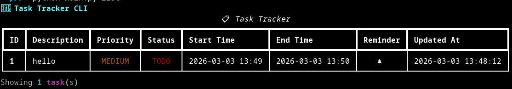
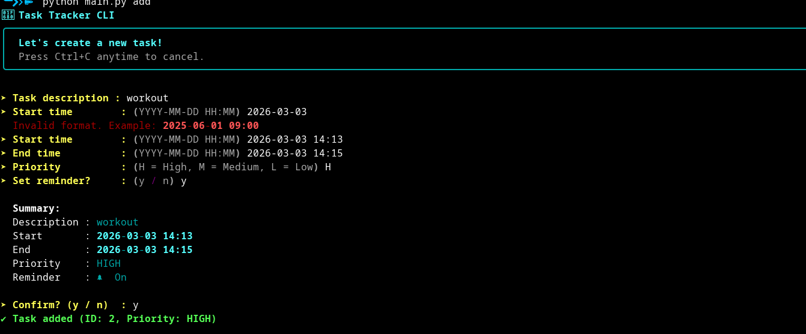
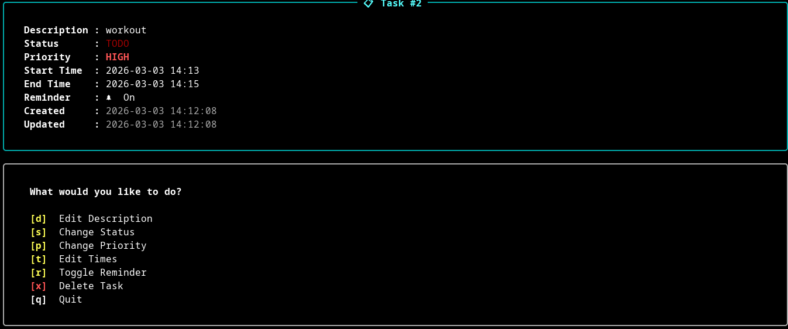

# 📋 Task Tracker CLI

A fast, lightweight command-line task manager built with Python. Add tasks interactively, track progress, set priorities, edit tasks with a single keypress, and get desktop reminders — all without leaving your terminal.


---

## 📸 Screenshots

### Task List View


### Interactive Add


### Task Detail View


---

## ✨ Features

- 🧠 **Interactive task creation** — just run `add`, no flags needed
- ✅ **Status tracking** — `TODO` → `IN_PROGRESS` → `DONE`
- 🔴🟡🟢 **Color-coded priorities** — `HIGH`, `MEDIUM`, `LOW`
- 🃏 **Interactive task view** — open any task and edit fields with a single keypress
- 🔍 **Filter tasks** by status or priority
- 🔔 **Desktop reminders** — get notified 1 minute before a deadline
- 💾 **Persistent storage** — tasks saved locally in JSON
- 🧪 **Full test suite** with `pytest`

---

## 🛠️ Tech Stack

- **Python 3.10+**
- **[Rich](https://github.com/Textualize/rich)** — Beautiful terminal UI
- **[Plyer](https://github.com/kivy/plyer)** — Cross-platform desktop notifications
- **[Readchar](https://github.com/magmax/python-readchar)** — Instant keypress detection
- **[Pytest](https://pytest.org)** — Automated testing

---

## ⚙️ Installation

**1. Clone the repository**
```bash
git clone https://github.com/your-username/TaskTracker.git
cd TaskTracker
```

**2. Create and activate a virtual environment**
```bash
# Create
python -m venv venv

# Activate — Mac/Linux
source venv/bin/activate

# Activate — Windows
venv\Scripts\activate
```

**3. Install dependencies**
```bash
pip install -r requirements.txt
```

**4. Linux users only — install dbus for notifications**
```bash
# Arch / Manjaro
sudo pacman -S python-dbus

# Fedora
sudo dnf install python3-dbus

# Debian / Ubuntu
sudo apt install python3-dbus
```

---

## 🚀 Usage

### ➕ Add a Task (Interactive)
Just run `add` — it will guide you step by step. No flags needed!
```bash
python main.py add
```
```
╭──────────────────────────────────╮
│  Let's create a new task!        │
╰──────────────────────────────────╯

➤ Task description : Build login page
➤ Start time       : 2025-06-01 09:00
➤ End time         : 2025-06-01 11:00
➤ Priority (H/M/L) : H
➤ Set reminder?    : y

  Summary:
  Description : Build login page
  Priority    : HIGH
  Reminder    : 🔔 On

➤ Confirm? (y/n) : y

✔ Task added (ID: 1, Priority: HIGH)
```

### 📋 List All Tasks
```bash
python main.py list
```

### 🔍 Filter Tasks
```bash
python main.py list --status TODO
python main.py list --status IN_PROGRESS
python main.py list --priority HIGH
```

### 🃏 View & Edit a Task Interactively
Open a task card and edit any field with a single keypress — no flags, no re-typing commands.
```bash
python main.py view 1
```
```
╭─────────── 📋 Task #1 ────────────╮
│  Description : Build login page   │
│  Status      : TODO               │
│  Priority    : HIGH               │
│  Start Time  : 2025-06-01 09:00   │
│  End Time    : 2025-06-01 11:00   │
│  Reminder    : 🔔 On              │
╰───────────────────────────────────╯

  [d]  Edit Description
  [s]  Change Status
  [p]  Change Priority
  [t]  Edit Times
  [r]  Toggle Reminder
  [x]  Delete Task
  [q]  Quit
```

### 🔄 Update Task Status
```bash
python main.py status 1 IN_PROGRESS
python main.py status 1 DONE
```

### ✅ Mark a Task Complete (Shortcut)
```bash
python main.py complete 1
```

### 🗑 Delete a Task
```bash
python main.py delete 1
```

### 🔔 Start Notification Service
```bash
python main.py notify
```
> Runs in the background and sends a desktop alert 1 minute before any task deadline. Press `Ctrl+C` to stop.

---

## 📁 Project Structure

```
TaskTracker/
├── main.py            # Core application logic + CLI
├── test_main.py       # Automated test suite
├── requirements.txt   # Project dependencies
├── .gitignore         # Files excluded from version control
├── screenshots/       # README screenshots
└── README.md          # You are here
```

---

## 🧪 Running Tests

```bash
pytest test_main.py -v
```

Expected output:
```
✅ 27 passed in 0.5s
```

---

## 📌 Commands Reference

| Command | Description |
|---------|-------------|
| `add` | Add a new task (interactive, no flags needed) |
| `list` | List all tasks |
| `list --status TODO` | Filter by status (`TODO`, `IN_PROGRESS`, `DONE`) |
| `list --priority HIGH` | Filter by priority (`HIGH`, `MEDIUM`, `LOW`) |
| `view <id>` | Open interactive task card — edit with keypresses |
| `status <id> <STATUS>` | Update task status |
| `complete <id>` | Mark task as DONE |
| `delete <id>` | Delete a task |
| `notify` | Start desktop notification service |

---

## 🤝 Contributing

Pull requests are welcome! For major changes, please open an issue first to discuss what you'd like to change.

1. Fork the repo
2. Create a feature branch (`git checkout -b feature/your-feature`)
3. Commit your changes (`git commit -m "feat: add your feature"`)
4. Push to the branch (`git push origin feature/your-feature`)
5. Open a Pull Request

---

## 📄 License

This project is licensed under the MIT License. See [LICENSE](LICENSE) for details.

---

> Built with ❤️ using Python & Rich